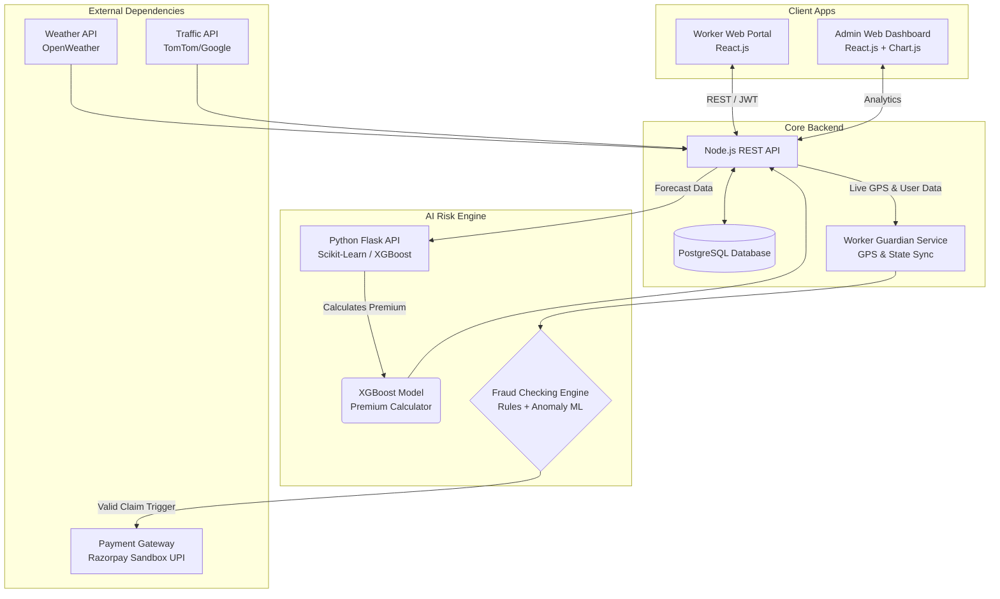
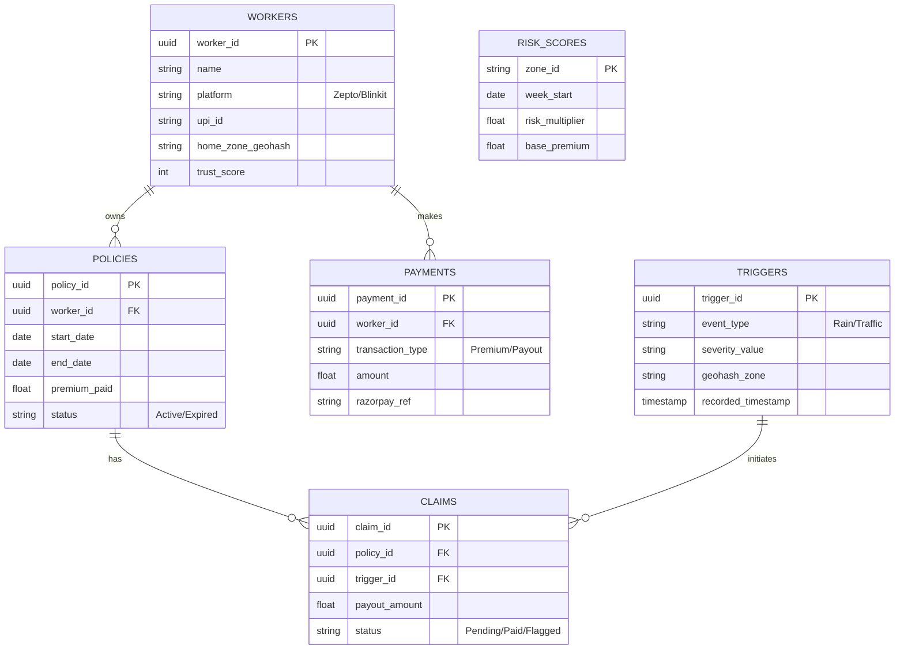

# 🛡️ Q-Shield 
**AI-Powered Income Protection for Gig Workers**

Parametric insurance that pays instantly when disruptions strike.
No claims. No paperwork. Just protection.

---

### 💸 Real Impact (Why This Matters)
**Mumbai | Heavy Rain (35mm/hr)**
→ Worker earns ₹800/day
→ Deliveries halted due to safety mandates
→ **₹300 credited in 28 seconds via UPI**

👉 *From disruption → detection → payout in under 30 seconds.*

---

## 🚀 1. The Real Problem: The "Active But Idle" Trap
India runs on 50M+ gig delivery partners, but their earning model is fundamentally fragile: **they don't earn salaries; they earn active minutes.**

When external shocks hit—a flash flood, a severe AQI spike, or an unplanned curfew—platforms restrict delivery zones or halt dark store operations entirely to ensure safety. 

For the worker, this creates a catastrophic systemic gap:
- ⏱️ **Stranded Time = Permanent Loss**: A 3-hour storm isn't a minor delay; it's 30% of their daily revenue permanently wiped out.
- 🚦 **Algorithmically Blocked**: They are logged in, standing by their bikes, fully ready to work—but the platform blocks them from receiving orders.
- 💸 **Immediate Financial Shock**: Missing a single peak-hour shift directly limits their ability to pay for tomorrow's fuel.

**Traditional insurance is useless here.** 
It covers hospitalizations and vehicle damage, but completely ignores the most frequent gig-economy crisis: **the involuntary, algorithmic loss of earning hours.**

---

## 💡 2. The Solution — Q-Shield
Q-Shield is a **Real-time income protection system** that:
- **Detects disruptions automatically**
- **Verifies worker eligibility instantly**
- **Pays income-loss via UPI in <30 seconds**

👉 *Built specifically for gig workers’ real-world constraints.*

---

## ⚙️ 3. How It Works (28-Second Flow)

1. 📡 **Monitor**: APIs track weather, traffic, and disruptions (every 5 min).
2. ⚡ **Detect**: Threshold breach → `DISRUPTION_EVENT` is triggered.
3. 🤖 **Validate**: GPS + policy + fraud checks complete in < 5 seconds.
4. 💸 **Pay**: Instant UPI transfer via Razorpay.

👉 **Total time: ~28 seconds.**

---

## 📱 4. Product Experience & UI Screens
*Designed for budget smartphones. Q-Shield is a lightweight Web PWA, bypassing app store friction and saving critical device storage for gig workers.*

> 🎨 **UI Prototype (Figma)**: [View High-Fidelity Screens →]([https://www.figma.com/your-link-here](https://www.figma.com/make/HoG8WAT4YlBdNFiZ3mrub3/Q-Commerce-Shield--Q-Shield-?t=L0yo7SJBb1ggV9qI-1)) 

**Worker Web Portal (React.js)**
- 🏠 **Worker Dashboard**: Clean interface accessible via mobile browser showing current location, local weather forecast, and "Earnings Protected Today" graphic.
- 🛡️ **Policy Activation Window**: A 1-click slider to activate the week's coverage, showing the AI-calculated dynamic premium (e.g., *"₹25 for April 4 - April 11"*).
- 🚨 **Claim Notification**: A browser alert/modal pop-up: *"Severe Rain Detected. Your ₹200 loss-of-income payout has been processed."*
- 📈 **Coverage Status**: History of past premiums paid and successful claim payouts.

**Insurer Platform (React Web Dashboard)**
- 🗺️ **Admin Analytics Dashboard**: A macro-view displaying:
  - 🔥 **Live Zone Disruption Heatmap**: A city-level map highlighting active parametric trigger zones in real-time.
  - 📉 **Live Loss Ratio Tracker**: Displays the current week's Loss Ratio (Payouts ÷ Premiums) per zone.
  - 💹 **Weekly Payout Volume Chart**: A time-series bar chart (Chart.js) showing total payout disbursements.

---

## 📡 5. Parametric Triggers
Fully data-driven events. No human claims adjusters.

| Trigger | Source | Threshold | Impact & Compensation |
|--------|--------|----------|------------------------|
| 🌧️ Heavy Rainfall | OpenWeather | >20mm/hr | Platform halts / ₹300 |
| 🌡️ Extreme Heat | Open-Meteo | >45°C | Slower SLAs / ₹250 |
| 🌫️ Pollution | WAQI | AQI >450 | Hazard conditions / ₹250 |
| 🚦 Traffic | TomTom | <5 km/h | SLA failure / ₹200 |
| 🚨 Social | Gov Alerts | High severity | Closures / ₹400 |

---

## 🧠 6. AI & Dynamic Pricing
Q-Shield uses an **XGBoost model** to predict disruption risk at a zone level.

**Inputs:**
- Weather patterns
- Traffic congestion
- Historical disruptions
- Worker density

**Output:**
- Weekly premium (₹15–₹40)

👉 *Higher risk = higher premium (capped for fairness)*

---

## 🏗️ 7. System Architecture (Event-Driven)
Built for scale, deterministic execution, and concurrency.

- **Trigger Engine**: Cron jobs aggressively poll APIs and broadcast events.
- **Event Bus**: Confirmed breaches publish to **Kafka / RabbitMQ** topics.
- **Execution Engine**: Microservices validate active worker state, GPS location against polygon zones, and policy status via PostgreSQL.
- **Payout Engine**: Connects to Razorpay UPI for instant transfer.

### Architecture Diagram
Our architecture integrates front-end apps, parametric monitors, an AI Risk Engine, and payment gateways into a unified workflow.

---

## 🗄️ 8. Database Design
A relational schema utilizing **PostgreSQL** to map gig workers to active policies and automated claims.

### Entity-Relationship Diagram

**Core Tables Summary**
- 👷 **Workers**: Stores delivery partner details and their `trust_score` (used to detect repeated anomalies).
- 📜 **Policies**: Tracks weekly micro-premium contracts and their active/expired status.
- 🚨 **Claims**: Automated payout records generated when a valid trigger occurs during an active policy.
- 🌩️ **Triggers**: Logs parametric events (e.g., heavy rain) pushed by external APIs associated with specific `geohash_zones`.
- 💸 **Payments**: The main ledger recording all incoming premiums and outgoing claim payouts.
- 📊 **Risk Scores**: Stores the pre-calculated AI risk multipliers for specific zones.

---

## 🛡️ 9. Fraud Detection Architecture
*Preventing systemic abuse is crucial for the insurance pool's viability. Q-Shield implements a strict four-layer check:*

- 📍 **GPS Spoofing Detection**: Cross-references Worker IP addresses against physical GPS coordinates. If an Android mock-location app is detected or pings jump 50km in 2 seconds, the claim is instantly locked.
- 🔁 **Duplicate Claims Detection**: Hard database constraints ensure only *one* valid claim per worker per recorded external disruption event block (e.g., maximum one heavy rain payout per 6-hour window).
- 🏙️ **Location Validation**: The worker’s geohash must explicitly fall within the polygon zone where the OpenWeather/Traffic API registered the parametric trigger.
- 📉 **Anomaly Detection (ML)**: Tracks the frequency of claims per worker compared to peers in the same zone. If `Worker A` claims 4x more heatwave disruptions than `Worker B` driving the same streets, their account is flagged for manual Insurer Review.

---

## 💰 10. Business Model & Financial Viability
*We ensure sustainability through high-volume micro-premiums and strictly capped payouts.*

- **Weekly Premium Scope**: Dynamic pricing between **₹15 to ₹40** depending on the AI predictive risk for the week.
- **Scale Example**: 100,000 active delivery workers paying an average of ₹25/week generates **₹1 Crore/month** in premium volume.
- **Estimated Payouts**: Payouts are sized strictly to replace lost wages (e.g., 3 lost hours = ₹250 payout). Because entire zones are affected simultaneously, the parametric nature eliminates individual claim investigation costs.
- **Sustainability Pool**: The AI model ensures that highly disruptive weeks (like Monsoon season) carry higher premiums (₹40), buffering the liquidity pool for periods of high automated payouts. If the Loss Ratio exceeds 70%, the AI automatically bumps base premiums across affected zones for the next cycle.

---

## 🔥 11. Real Scenario
**Rahul (Blinkit, Mumbai)**
- **Earnings**: ₹800/day
- **3:00 PM**: Rain hits (35mm/hr) → Deliveries halted by platform.
- **3:04 PM**: ₹300 loss-of-income payout credited instantly to his wallet.

👉 *Income protected. No action required.*

---

## 🚀 12. Why Q-Shield Wins
- ✅ **Instant payouts** (<30s)
- ✅ **Zero paperwork**
- ✅ **AI-driven pricing**
- ✅ **Fraud-resistant system**
- ✅ **Built for real gig worker behavior**

👉 *Not traditional insurance — automated income protection.*

---

## 🛠️ 13. Tech Stack
- **Frontend (PWA & Admin)**: Next.js 16, React, Tailwind CSS, Framer Motion
- **Backend & Queue**: Node.js, Express, Kafka / RabbitMQ
- **AI/ML Core**: Python Flask, Scikit-learn, XGBoost
- **Database**: PostgreSQL (Supabase)
- **External APIs**: OpenWeatherMap, WAQI, TomTom Traffic
- **Payments**: Razorpay UPI Sandbox

---

## 🔮 14. Future Enhancements
*Innovative features planned beyond the Phase 3 hackathon scope:*

- **Platform API Integration**: Direct integrations with Swiggy/Zepto gig worker APIs to verify exact shift logins and live delivery volumes, eliminating pure GPS-based tracking.
- **Predictive Disruption Alerts**: Nudging workers: *"High probability of rain at 4 PM. Stay online to qualify for disruption payouts."*
- **Satellite Weather Risk**: Using advanced Copernicus satellite imagery to model micro-climate waterlogging risks before they happen.
- **Worker Income Stability Score**: Generating a financial stability score for workers based on their continuous policy retention, which could be used for micro-loans or platform perks.

---
*Built for the Guidewire DEVTrails 2026 hackathon.*
*Because every delivery deserves protection.* 🛡️

👉 *From uncertainty to guaranteed income — in under 30 seconds.*
