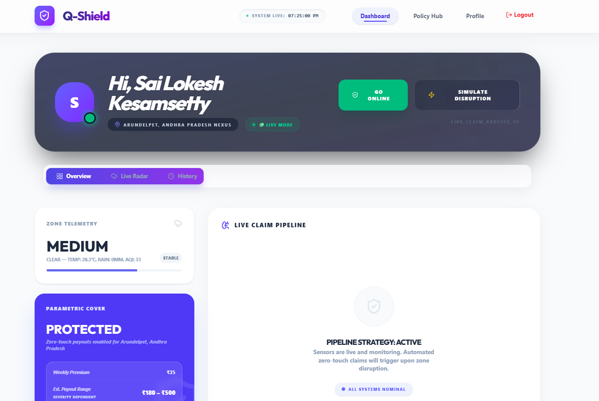
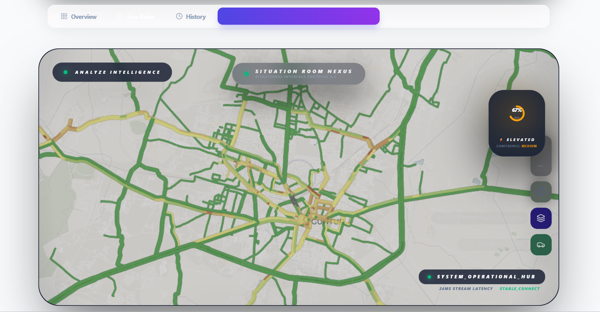
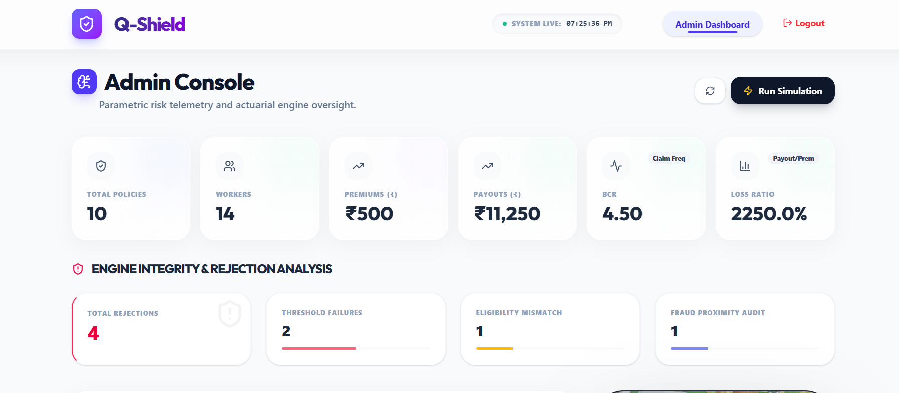
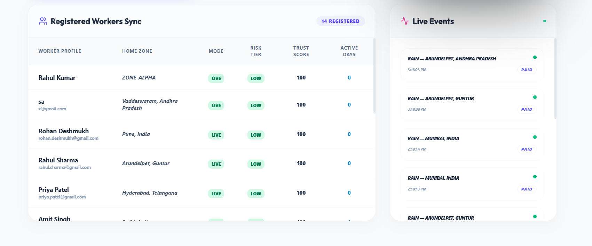

# 🛡️ Q-Shield: The Income-Protection Layer for the Gig Economy
**Autonomous, AI-Driven Parametric Insurance for Quick-Commerce Delivery Partners.**

---

## 🌩️ The Problem: The Invisible Cost of Urban Disruption
Every day, millions of delivery partners lose their daily wages when heavy rain, toxic pollution, or extreme traffic gridlock force quick-commerce platforms to pause operations. **For a gig worker, no delivery means zero income.** 

Traditional insurance is too slow, too expensive, and too friction-heavy for a worker earning ₹500 a day. They don't need a 30-day investigation; they need their lost wages replaced **instantly**.

## 🚀 The Solution: Q-Shield
**Q-Shield** is a parametric insurance engine that eliminates the "claim process" entirely. By utilizing real-time environmental telemetry and autonomous AI rules, Q-Shield detects disruptions as they happen and triggers **instant, zero-touch payouts** directly to a worker's wallet.

---

## 🧠 Why Parametric Insurance?
Parametric insurance is a revolutionary model where the payout is triggered by a **pre-defined event** (e.g., Rainfall > 20mm/hr) rather than a manual damage assessment.

| Feature | Traditional Insurance | 🛡️ Q-Shield (Parametric) |
| :--- | :--- | :--- |
| **Claim Process** | Manual forms, calls, and weeks of waiting | **Zero-Touch (Fully Automated)** |
| **Verification** | Human surveyors and manual audits | **Rule-Based (API + IoT Sensors)** |
| **Payout Speed** | 15 - 45 Days | **Instant (Seconds after disruption)** |
| **Friction** | High (Documentation required) | **None (Autonomous detection)** |

---

## ⚙️ How It Works: The Autonomous Pipeline

1.  **🛡️ Policy Activation**: Worker purchases a weekly micro-premium policy (e.g., ₹50) via the dashboard.
2.  **📡 Real-Time Monitoring**: Q-Shield monitors high-fidelity APIs (Weather, AQI, TomTom Traffic) across urban "Nexus Zones."
3.  **⚡ Threshold Breach**: A parameter (e.g., 50mm/hr Rainfall) breaches a critical severity threshold in the worker's zone.
4.  **🔒 Automated Validation**: The engine verifies the worker's active status and uses **GPS Proximity Audits** to prevent fraud.
5.  **💸 Instant Disbursement**: A payout (e.g., ₹250) is pushed instantly to the worker's linked bank/UPI account.

---

## 🖥️ Product Showcase (UI/UX)

#### **1. The Digital Entry Point (Landing Page)**
A high-impact, premium hero section that immediately communicates the value proposition: **AI-Powered Parametric Insurance**.
> 

#### **2. Worker Dashboard **
A high-fidelity, glassmorphism-inspired interface showing live environmental risk, active coverage status, and a real-time automated claim pipeline.
> 

#### **3. Live Situational Radar**
Real-time integration with RainViewer and TomTom APIs. Workers can see disruption "heatmaps" and gridlock zones in high-contrast detail.
> 


#### **4. Admin Command Center**
For insurers to monitor BCR (Benefit-Cost Ratio), loss ratios, and active claim velocity across the entire city.
> 

#### **5. Analytics & Operational Intelligence**
Deep-dive into payout velocity trends and localized fraud identification.
> 

#### **6. Worker Ecosystem Sync**
Live monitoring of all registered partners and their status across various nexus zones.
> 

---


## ⚡ Live Demo Flow 

Experience the full autonomous lifecycle in under 60 seconds:

1.  **Login as Worker**: Use `test@worker.com` / `password123`.
2.  **Go Online**: Click the **"GO ONLINE"** button. This primes your GPS telemetry and sets your mode to **DEMO**.
3.  **Simulate Disruption**: Click the **"SIMULATE DISRUPTION"** button.
4.  **Watch the Pipeline**: The UI will refresh instantly to show a live claim being processed through **Threshold**, **Eligibility**, **Fraud Check**, and **Payout**.
5.  **Verify History**: Go to the **History Tab** to see the transaction receipt and payout log.

> [!TIP]
> **Rejection Scenario**: If you are "Offline" or outside the disruption radius, click Simulate and watch as the engine gracefully rejects the claim with a specific reason (e.g., "Fraud: Location Mismatch").

---

## 💎 Key Innovations 

- **🚀 Zero-Touch Claim Engine**: The industry's first completely autonomous settlement pipeline for micro-insurance.
- **🛡️ GPS-Based Fraud Validation**: Uses the Haversine formula to ensure workers are physically present in the zones where disruptions occurred during the claim window.
- **🧪 Dual Mode System**: A sophisticated `LIVE` vs `DEMO` flag architecture allows for safe, 100% successful hackathon demonstrations without breaking production data.
- **📈 Real-Time Actuarial Analytics**: Admins can see the financial viability of the insurance pool (BCR, Loss Ratio) as it fluctuates in real-time.

---

## 🧬 System Architecture (Explained)

Q-Shield is built on an **Event-Driven Architecture**:

1.  **Trigger Layer**: `triggerService.js` polls WeatherAPI and TomTom Every 30s. If a disruption is detected, it broadcasts a `TRIGGER_RED` event.
2.  **Validation Layer**: `claimService.js` receives the event and identifies all workers in the affected zone with active policies.
3.  **Fraud Layer**: `fraudService.js` cross-references the worker's last "Online" GPS ping with the disruption center to ensure legitimacy.
4.  **Payout Layer**: `payoutService.js` (Simulated) initializes the financial transfer and updates the **Supabase** ledger.
5.  **UI Sync**: Frontend hooks (`useWorkerTelemetry`) detect the DB change and trigger a premium "Claim Settled" animation in the dashboard.

---

## 🛠️ Tech Stack & Scalability

-   **Frontend**: React 19, Vite, Tailwind CSS (Glassmorphism), Leaflet (Maps), Chart.js.
-   **Backend**: Node.js/Express (Event-Driven Services).
-   **Database**: Supabase (PostgreSQL) for relational integrity and real-time syncing.
-   **Intelligence**: Integration with WeatherAPI, RainViewer, and TomTom Traffic.

---

## 🚀 Getting Started

**Backend Setup:**
```bash
cd backend
npm install
# Configure .env with DATABASE_URL, WEATHER_API_KEY, TOMTOM_API_KEY
npm run dev
```

**Frontend Setup:**
```bash
cd frontend
npm install
# Configure .env with VITE_TOMTOM_API_KEY
npm run dev
```

---

## 🔮 Future Scope & Real-World Potential

Q-Shield is not just for delivery partners; it’s a blueprint for the future of specialized insurance:
- **🤖 AI-Based Predictive Underwriting**: Using ML to predict rainfall patterns and adjust premiums dynamically *before* the week begins.
- **🗺️ Global Scalability**: Expanding geofencing to cover Agriculture (Drought insurance) and Travel (Flight delay payouts).
- **🔗 Blockchain Audit Trail**: Moving the claim ledger to a public blockchain for 100% transparency in the claim-settlement process.
- **📱 Real Razorpay Integration**: Moving from simulation to live UPI disbursements via Razorpay X.

## ❤️ Why This Matters
At its core, **Q-Shield** is about human stability. It ensures that the people who power our modern commerce don't have to choose between their safety and their survival. **When the city stops, their income shouldn't.**

---
**Designed with passion.**
