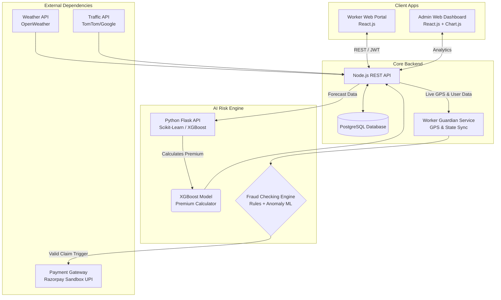
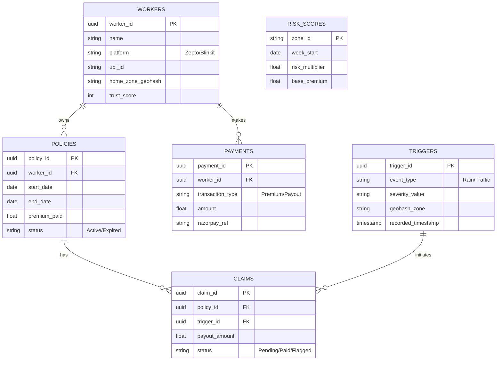

# 🛡️ Q-Commerce Shield (Q-Shield)
AI-Powered Parametric Insurance for Quick-Commerce Delivery Partners

---

## 🚀 1. The Core Strategy & Persona Focus

**The Persona**: **Quick Commerce Delivery Partners** (e.g., Zepto, Blinkit, Swiggy Instamart).

**Behavioral Insight & Daily Workflow**: 
Operating in grueling 10-14 hour shifts, these workers complete 20+ rapid micro-deliveries daily. Their workflow is bound by uncompromising constraints: relentless smartphone battery drain, constant reliance on GPS routing, and unpredictable shift patterns. They are 100% dependent on daily active earnings to sustain their livelihoods and operate on razor-thin margins.

**The Problem**: 
When severe weather (flash floods, intense heatwaves) or social disruptions (unplanned curfews, localized strikes) hit, platform safety mandates abruptly halt dark store operations or constrict delivery radii. During these systemic disruptions, workers remain stranded on the road—consuming phone battery and time—while their active income plummets to **zero** through an unavoidable systemic shock completely outside their control.

**The Solution**: 
Q-Shield gives these gig workers a micro-premium, weekly safety net. It automatically triggers payouts for **loss of income** when external disruptions arbitrarily halt their work. 

> **Crucial Constraint Met**: Coverage is strictly for **LOSS OF INCOME ONLY**. We explicitly exclude health insurance, medical bills, life insurance, or vehicle repair payouts. 

### 📱 Workflow Scenario
1. **Monday Activation**: Rahul pays his dynamic micro-premium for the week (e.g., ₹25), auto-deducted from his platform wallet.
2. **Wednesday Disruption**: A severe thunderstorm hits his geofenced dark-store zone. The platform restricts deliveries.
3. **Automated Trigger**: The Parametric system detects Rainfall > 20mm/hr via the OpenWeatherMap API for Rahul's specific pinged location.
4. **Resolution**: *Zero-Touch Claim* is initiated. The system calculates the lost functional hours based on his historical average and triggers an instant income-loss payout (e.g., ₹300) directly to his UPI wallet.

---

## 💸 2. Weekly Premium Model & Parametric Triggers

Gig workers operate paycheck-to-paycheck. An annual premium model is unviable. Q-Shield utilizes a **dynamic weekly premium** (ranging from ₹15 to ₹40), aligned perfectly with their typical payout cycle.

**How the AI Weekly Premium Works**:
If the predictive ML model forecasts clear operations for the upcoming week in the worker's specific zone, the premium drops to the ₹15 floor. If a severe monsoon or heatwave is predicted, the premium dynamically shifts up to ₹40 for that specific week (capping out to protect the worker from predatory pricing).

**Parametric Triggers (Automated Zero-Touch Claims)**:
We monitor real-time APIs to automate payouts without the worker lifting a finger:
1. 🌩️ **Environmental (Weather)**: OpenWeatherMap API triggers when detecting heavy rainfall (> 20mm/hr) or extreme heatwaves (> 45°C).
2. 🌫️ **Environmental (Air Quality)**: AQI API triggers when pollution reaches hazardous levels (AQI > 450), which often forces platform-wide limitations.
3. 🚦 **Infrastructure (Traffic/Waterlogging)**: Google Maps / TomTom API detects "Severe Gridlock" where the average zonal speed drops below 5 km/h, preventing Q-Commerce SLAs from being met.
4. 🚨 **Social Disruptions (Unplanned Curfews/Strikes)**: A Government Alert RSS feed or News Sentiment API triggers when detecting unplanned curfews, local strikes, or sudden zone closures (e.g., alert severity level > "High" or sentiment < -0.8).

### ⚙️ Technical Foundation: System Logic & Claim Execution
To ensure airtight logic, the claim execution follows a fully deterministic backend flow:
- **Trigger Phase**: A cron job aggressively polls external APIs (Weather, Traffic, Alerts) every 5 minutes. If a threshold is consistently breached over three consecutive polling cycles, a `DISRUPTION_EVENT` is broadcasted for that specific geohash zone.
- **Eligibility Validation**: The system queries the `POLICIES` table for active workers within the affected geohash. It enforces strict conditions: verifying via the `WORKERS` state that the user was *actively logged in* and accepting orders immediately prior to the trigger, and cross-referencing GPS history to validate physical presence inside the disrupted zone.
- **Data Validation & Payout Exec**: Validated workers enter a queue where a secure webhook initiates an immediate ledger update. The backend passes a Razorpay UPI transaction payload via a message broker (RabbitMQ/Kafka) to prevent race conditions. Upon payment gateway confirmation, the worker's app receives a WebSocket notification of the transfer.

---

## 🧩 3. System Architecture Diagram

Our architecture integrates front-end apps, parametric monitors, an AI Risk Engine, and payment gateways into a unified workflow.

---

## 🧠 4. AI & ML Integration Architecture

1. **Dynamic Risk-Priced Premium Model**: 
   Instead of rigid static rules, we deploy an **XGBoost regression pipeline** to predict granular zone-level risk and dynamically price the weekly micro-premium (₹15-₹40). 
   - **Why AI over Simple Rules?**: Rule-based pricing fails catastrophically against compounding variables (e.g., moderate rain + heavy traffic + Friday evening = extreme disruption). AI precisely models complex, non-linear interactions across spatial and temporal domains.
   - **Data Sources & Feature Engineering**: Input features include spatio-temporal embeddings, 7-day rolling traffic congestion averages (TomTom API), meteorological indices (IMD precipitation data), and real-time active worker density metrics. 
   - **Decision Logic**: The model calculates the weekly disruption probability for each geohash zone. This probability directly maps to our continuous ₹15-₹40 premium curve, translating raw risk into a fair price.
   - **Model Retraining**: The model tracks inference drift and retrains bi-weekly via an automated CI/CD pipeline, ensuring risk calibration adapts to changing seasonal baselines. For the hackathon, synthetic data generation via Scikit-learn's `make_regression` simulates these edge-case triggers.

2. **Fraud Detection Engine**: 
   A rigorous dual-layer architecture. Primary backend rules validate hardware and location inputs, while a secondary Unsupervised ML algorithm searches for behavioral anomalies in user claim histories. *(Expanded in Section 12)*.

---

## 📊 5. Fraud Detection Architecture

Preventing systemic abuse is crucial for the insurance pool's viability. Q-Shield implements a strict four-layer check:

- 📍 **GPS Spoofing Detection**: Cross-references Worker IP addresses against physical GPS coordinates. If an Android mock-location app is detected or pings jump 50km in 2 seconds, the claim is instantly locked.
- 🔁 **Duplicate Claims Detection**: Hard database constraints ensure only *one* valid claim per worker per recorded external disruption event block (e.g., maximum one heavy rain payout per 6-hour window).
- 🏙️ **Location Validation**: The worker’s geohash must explicitly fall within the polygon zone where the OpenWeather/Traffic API registered the parametric trigger.
- 📉 **Anomaly Detection (ML)**: Tracks the frequency of claims per worker compared to peers in the same zone. If `Worker A` claims 4x more heatwave disruptions than `Worker B` driving the same streets, their account is flagged for manual Insurer Review.

---

## 🗄️ 6. Database Design

A relational schema utilizing **PostgreSQL** to map gig workers to active policies and automated claims.

### Entity-Relationship Diagram

### Core Tables Summary
- 👷 **Workers**: Stores delivery partner details and their `trust_score` (used to detect repeated anomalies).
- 📜 **Policies**: Tracks weekly micro-premium contracts and their active/expired status.
- 🚨 **Claims**: Automated payout records generated when a valid trigger occurs during an active policy.
- 🌩️ **Triggers**: Logs parametric events (e.g., heavy rain) pushed by external APIs associated with specific `geohash_zones`.
- 💸 **Payments**: The main ledger recording all incoming premiums and outgoing claim payouts.
- 📊 **Risk Scores**: Stores the pre-calculated AI risk multipliers for specific zones.

---

## 💰 7. Business Model & Financial Viability

We ensure sustainability through high-volume micro-premiums and strictly capped payouts.

- **Weekly Premium Scope**: Dynamic pricing between **₹15 to ₹40** depending on the AI predictive risk for the week.
- **Scale Example**: 100,000 active delivery workers paying an average of ₹25/week generates **₹1 Crore/month** in premium volume.
- **Estimated Payouts**: Payouts are sized strictly to replace lost wages (e.g., 3 lost hours = ₹250 payout). Because entire zones are affected simultaneously, the parametric nature eliminates individual claim investigation costs.
- **Sustainability Pool**: The AI model ensures that highly disruptive weeks (like Monsoon season) carry higher premiums (₹40), buffering the liquidity pool for periods of high automated payouts. If the Loss Ratio exceeds 70%, the AI automatically bumps base premiums across affected zones for the next cycle.

---

## 🖥️ 8. UI Screens & Prototype Description

> 🎨 **UI Prototype (Figma)**: [View High-Fidelity Screens →](https://www.figma.com/your-link-here) *(Link to be updated before March 20, EOD)*

**Worker Web Portal (React.js)**
- 🏠 **Worker Dashboard**: Clean interface accessible via mobile browser showing current location, local weather forecast, and "Earnings Protected Today" graphic.
- 🛡️ **Policy Activation Window**: A 1-click slider to activate the week's coverage, showing the AI-calculated dynamic premium (e.g., *"₹25 for April 4 - April 11"*).
- 🚨 **Claim Notification**: An browser alert/modal pop-up: *"Severe Rain Detected. Your ₹200 loss-of-income payout has been processed."*
- 📈 **Coverage Status**: History of past premiums paid and successful claim payouts.

**Insurer Platform (React Web Dashboard)**
- 🗺️ **Admin Analytics Dashboard**: A macro-view displaying:
  - 🔥 **Live Zone Disruption Heatmap**: A city-level map highlighting active parametric trigger zones in real-time.
  - 📉 **Live Loss Ratio Tracker**: Displays the current week's Loss Ratio (Payouts ÷ Premiums) per zone.
  - 💹 **Weekly Payout Volume Chart**: A time-series bar chart (Chart.js) showing total payout disbursements.

---

## 🔮 9. Future Enhancements

Innovative features planned beyond the Phase 3 hackathon scope:
- **Platform API Integration**: Direct integrations with Swiggy/Zepto gig worker APIs to verify exact shift logins and live delivery volumes, eliminating pure GPS-based tracking.
- **Predictive Disruption Alerts**: Nudging workers: *"High probability of rain at 4 PM. Stay online to qualify for disruption payouts."*
- **Satellite Weather Risk**: Using advanced Copernicus satellite imagery to model micro-climate waterlogging risks before they happen.
- **Worker Income Stability Score**: Generating a financial stability score for workers based on their continuous policy retention, which could be used for micro-loans or platform perks.

---

## 💻 10. Tech Stack & Development Plan

**Why a Progressive Web App (PWA) over Native Mobile?**
We purposefully chose a Web platform (PWA via React.js) to ensure frictionless adoption. Delivery partners overwhelmingly rely on budget Android devices with limited storage capacity. A PWA eliminates app store friction while delivering a fast, near-native experience. Modern PWAs offer offline-capable design through Service Workers, ensuring accessibility even during poor network conditions accompanying severe weather.

- **Frontend (Worker Web Portal)**: React.js (Tailwind CSS).
- **Frontend (Admin Dashboard)**: React.js with Chart.js.
- **Backend Architecture**: Node.js and Express.js REST API.
- **Database**: PostgreSQL hosted on Supabase.
- **AI/ML Layer**: Python (Scikit-learn, XGBoost, Pandas) via Flask API.
- **Public APIs Used**: OpenWeatherMap API, Google Maps API, Razorpay Test Mode.

---

## 📅 11. Hackathon Execution Roadmap

- **Phase 1 [Weeks 1-2]: Ideation & Foundation (*Current*)**
  - Define persona constraints, finalize architecture (README), structure database schemas, and create high-fidelity UI/UX dummy screens using Figma.
  - Deliver a 2-minute video.
- **Phase 2 [Weeks 3-4]: Automation & Protection**
  - Develop worker registration web flow, train premium calculator, and integrate OpenWeather API.
- **Phase 3 [Weeks 5-6]: Scale & Optimise**
  - Implement location-check fraud logic, simulate instant UPI API payouts with Razorpay Sandbox, build the web dashboard UI, and create the final 5-minute screencast presentation.

---

## 🚨 12. Adversarial Defense & Anti-Spoofing Strategy

A zero-trust model is vital to protect the parametric liquidity pool from systemic exploitation. This layer defends against organized exploitation of zero-touch claims.

### A. Fraud Ring Detection (Group-Level)
We mitigate coordinated attacks using spatial-temporal clustering. If the anomaly detection engine identifies an unnatural concentration of new policy creations or synchronized GPS ping clusters originating from isolated IP subnets or specific dark stores, it instantly triggers group-level rate limits to halt mass extraction.

### B. Multi-Source Location Verification
Because raw GPS coordinates are easily spoofed, we enforce strict cross-validation:
- **IP vs. GPS Mismatch**: Validates that telecom assigned IP geography logically aligns with the device's reported lat/long.
- **Movement Physics Validation**: Rejects impossible physical trajectories (e.g., pinging 50km apart in 2 seconds).
- **Device Fingerprinting (Optional Layer)**: Flags multiple localized claims originating repeatedly from the exact same physical device footprint.

### C. Behavioral Trust Scoring
Every deployed worker profile accrues a dynamic `trust_score`:
- **Pattern Tracking**: The system evaluates longitudinal claim frequency, historical location consistency, and peer comparison deviations (e.g., Worker A claims 5x more anomalies than Worker B operating in identical conditions).
- Low trust scores bypass automatic payouts and force a delayed T+1 manual insurer review.

### D. Fairness Layer
To prevent legitimate workers from being unjustly penalized by anti-fraud tripwires, we deploy a crucial fairness mechanism:
- **Soft Flags over Hard Rejections**: Suspicious accounts receive warnings and "soft flags" triggering human review, avoiding automatic lifetime bans.
- **Zone-Level Validation**: If 95% of workers in a known flooded zone execute legitimate claims, edge-case outliers inside that polygon are granted the benefit of the doubt rather than blocked.

### E. Attack Response Strategy
During a detected localized spike in anomalous activity, the system engages an automated defense posture:
- **Payout Throttling**: Automatically shifts from instant UPI transfers to T+1 settlement windows to allow deep auditing.
- **Stricter Validation**: Temporarily raises the programmatic threshold for location and login certainty.
- **Adaptive Premium Adjustment**: Factors the increased adversary risk vector into the subsequent week's dynamic premium calculation for the affected zone.
