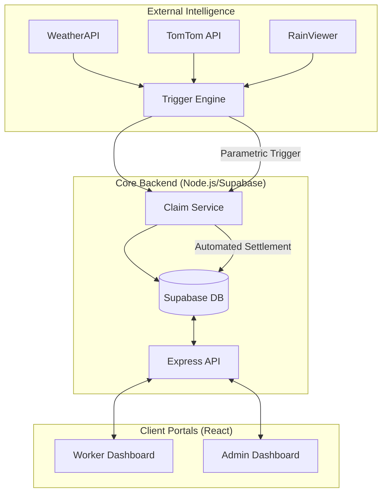

# 🛡️ Q-Shield (Parametric Insurance)
**AI-Driven Parametric Insurance for Quick-Commerce Delivery Partners**

Q-Shield is a state-of-the-art parametric insurance platform designed to provide a financial safety net for gig workers (Blinkit, Swiggy, Zepto, etc.) during urban disruptions. Unlike traditional insurance, Q-Shield uses real-time telemetry (Weather, Traffic, AQI) to trigger **instant, zero-touch payouts** when external conditions prevent partners from earning.

---

## ✨ Core Features

### 📡 Real-Time Situational Awareness
- **Live Risk Telemetry**: Monitoring AQI (Hazardous), Rainfall (mm/hr), Temperature (Extreme Heat), and Traffic Density (Gridlock).
- **Interactive Radar**: Integrated Leaflet maps with RainViewer and TomTom live traffic overlays.
- **Dynamic Risk Adjustment**: AI-calculated premiums based on real-time zonal risk assessments.

### 🛡️ Automated Claims Pipeline
- **Zero-Touch Settlement**: No application forms or manual audits. Claims are automatically triggered by the Parametric Engine.
- **Multi-Stage Validation**: 
    1. **Threshold Check**: Environmental parameters must meet high-severity levels.
    2. **Eligibility Audit**: Active policy check and worker platform verification.
    3. **Fraud Proximity**: Haversine distance verification to ensure the worker is in the affected zone.
- **Instant Payouts**: Simulated Razorpay API flow for immediate income-loss replacement.

### 📊 Enterprise Command Center
- **Actuarial Analytics**: Real-time monitoring of BCR (Benefit-Cost Ratio) and Loss Ratios.
- **Trigger Simulation**: Admin tool to push anomalous events to specific zones for testing.
- **Worker Sync**: Live registry of all registered partners with their trust scores and risk tiers.

---

## 🛠️ Technology Stack

### Frontend (v19.0)
- **Framework**: React + Vite
- **Styling**: Tailwind CSS (Premium Glassmorphism Theme)
- **Maps**: React-Leaflet + OpenStreetMap + TomTom API
- **Charts**: Chart.js + React-Chartjs-2
- **Interactions**: Framer Motion + Lucide Icons

### Backend (Node.js)
- **Engine**: Express.js REST API
- **Database**: Supabase (PostgreSQL)
- **Services**: Event-driven Claim Service & Real-time Trigger Engine
- **Monitoring**: node-cron for scheduled situational audits

---

## 🚀 Getting Started

### 1. Prerequisites
- Node.js (v18+)
- Supabase Account (PostgreSQL)
- API Keys: [WeatherAPI](https://www.weatherapi.com/), [TomTom](https://developer.tomtom.com/)

### 2. Installation
```bash
# Clone the repository
git clone https://github.com/your-username/q-shield.git
cd q-shield

# Setup Backend
cd backend
npm install
# Create .env with DATABASE_URL, WEATHER_API_KEY, TOMTOM_API_KEY

# Setup Frontend
cd ../frontend
npm install
# Create .env with VITE_TOMTOM_API_KEY
```

### 3. Running Locally
```bash
# Terminal 1: Backend
npm run dev

# Terminal 2: Frontend
npm run dev
```

---

## 🧬 System Architecture



---

## 📈 Database Schema
The platform uses a robust PostgreSQL schema handled via Supabase:
- **`workers`**: Identity vault with GPS check-in history.
- **`policies`**: Active parametric coverage contracts.
- **`triggers`**: Log of environmental anomalies.
- **`claims`**: Detailed audit trail of all settlements/rejections.
- **`payouts`**: Financial ledger for income-loss replacement.

---

## 🏆 Project Goal
To eliminate the income gap for delivery partners by replacing traditional, friction-heavy insurance with a **transparent, rule-based, and autonomous** financial protection layer. 

*Designed for the Guidewire DEVTrails 2026 Hackathon.*
